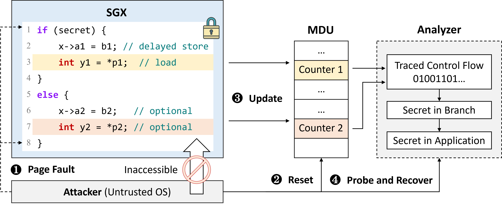

# MDPeek Attack

## Introduction

This repository contains the following components:

1. Code to validate the feasibility of **MDPeek** against SGX.
2. An end-to-end MDPeek attack example targeting **MbedTLS**.


```shell
.
├── attack-demo       -- Code to validate the feasibility of MDPeek
└── attack-mbedtls    -- Attack example targeting MbedTLS
```

Each directory contains a more detailed `readme.md` file, which outlines the environment requirements, build instructions, and usage.

## MDPeek Attack

MDPeek is a side-channel attack targeting Intel SGX, exploiting updates in the Memory Dependence Unit (MDU) counters of Intel CPUs. By detecting these changes, an attacker can infer which load instructions are executed, thereby leaking control-flow information from applications within Intel SGX. If the inferred control-flow information is related to secrets (e.g., RSA keys), the secrets will be leaked.

In the MDPeek threat model, the victim is a user application running inside SGX, with branch instructions dependent on secrets. At least one store-load pair exists on one of the branch paths, where the address generation of the store is delayed, triggering an MDU update. The attacker, a malicious OS with root privileges, hijacks the victim's control flow via a page fault and uses the MDU side-channel to deduce the victim's branch direction, thereby leaking the secret.

The attack process is illustrated in **Figure 1**. The attacker hijacks the control flow via a page fault (①) before the victim executes a branch dependent on secret data (line 1), then initializes the MDU state (②). Due to the delayed store, the load instruction on the branch path updates specific MDU counters (line 2,3,6,7), as the MDU counters are indexed by the least significant 8 bits of the load instruction's program counter (③). After the branch is executed, the attacker hijacks the control flow again and probes the MDU updates (④), leaking the victim’s `secret`.

<figure style="text-align: center;">
    
    <figcaption style="text-align: center;">Figure 1. Workflow of MDPeek.</figcaption>
</figure>

## Research Paper

For more detailed research on MDPeek, please refer to the paper *MDPeek: Breaking Balanced Branches in SGX with Memory Disambiguation Unit Side Channels*, which has been accepted to the Proceedings of the 30th ACM International Conference on Architectural Support for Programming Languages and Operating Systems (ASPLOS 25).